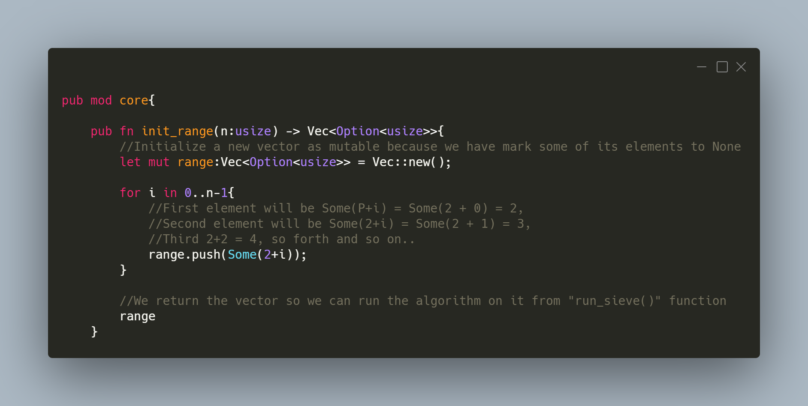
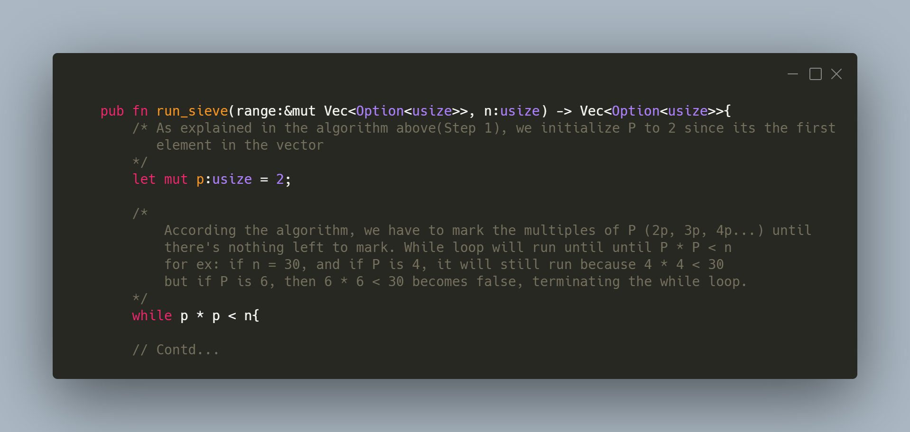
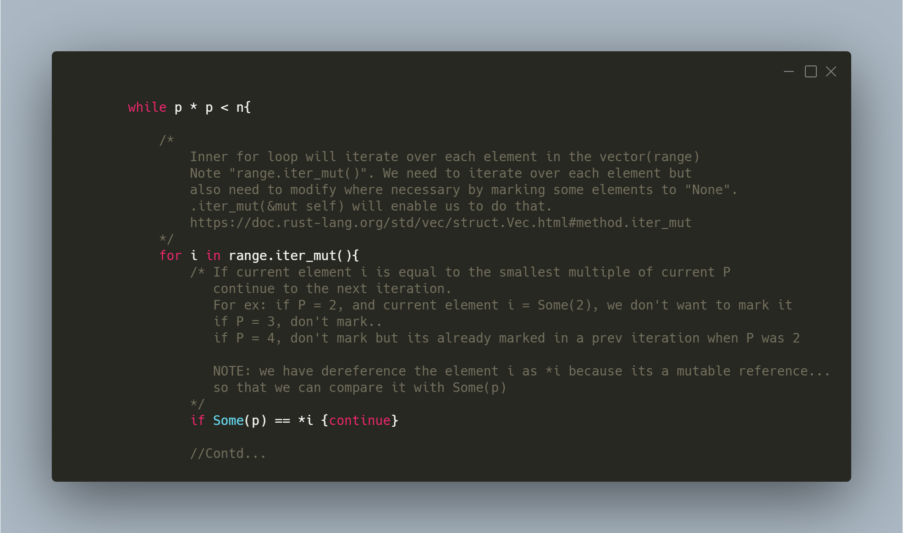
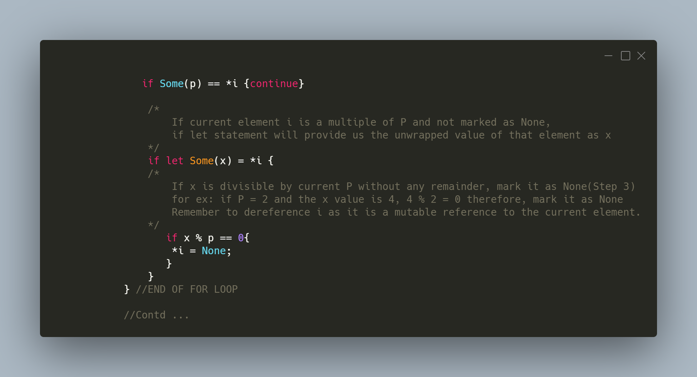
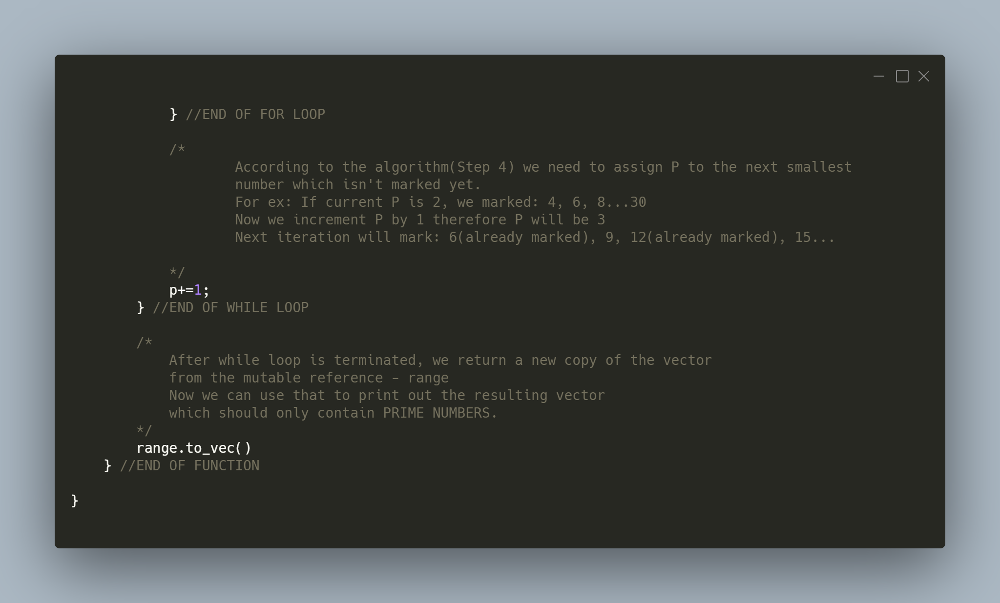
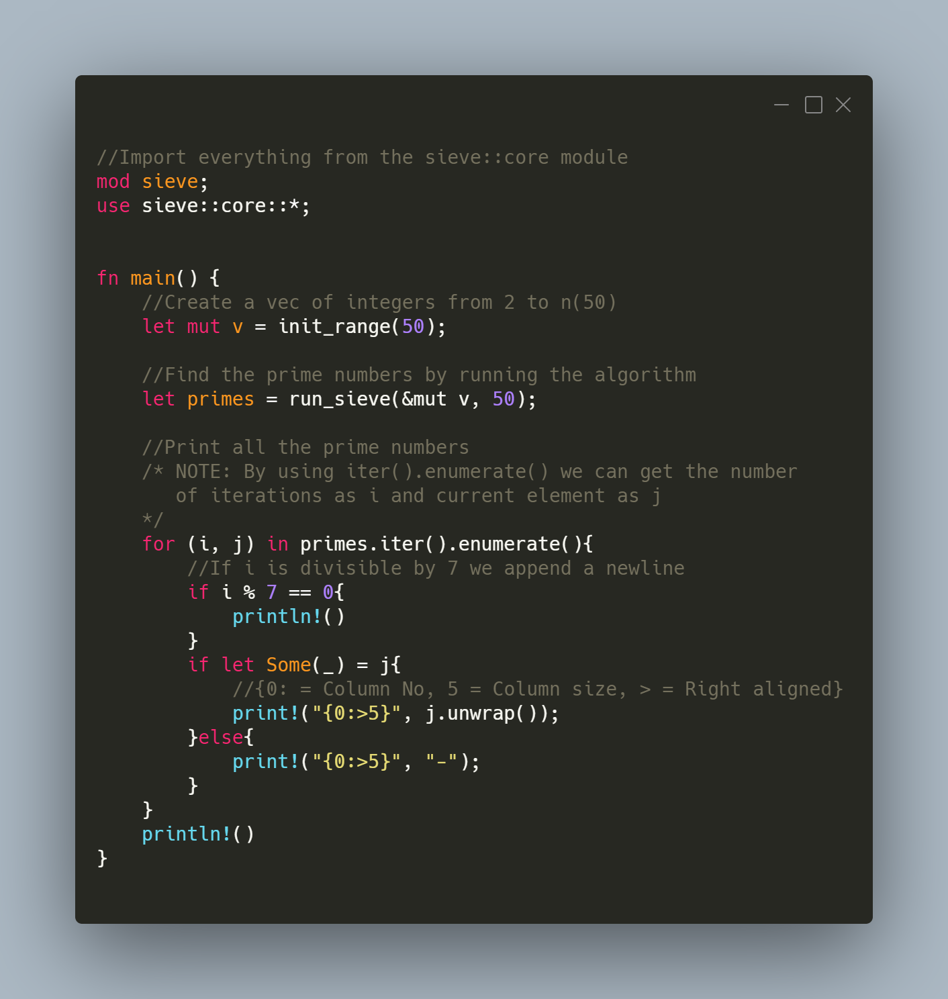
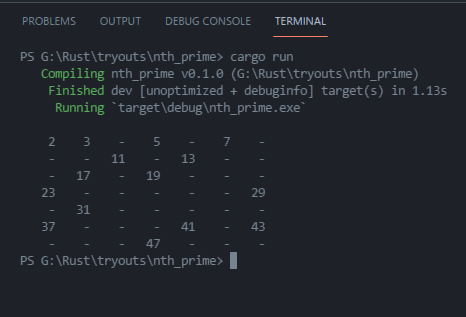

# Sieve of Eratosthenes


### **Introduction**

After solving the Nth Prime challenge(Easy) hosted on [exercism.io](https://exercism.io/) I decided to
do a bit of a modification and find the prime numbers up to N instead. I've thoroughly explained the code
through comments for your convenience.


### **Sieve of Eratosthenes Algorithm in a nutshell**
- create an array of integers from 2 to N where N = Upper bound of the search (lets say 1000)
- Initialize a variable called P and initialize it to the first element and the smallest prime no: 2.
- Iterate through the array and mark the multiples of P except p(4, 6, 8, 10...) until you reach N
- Find the next smallest number greater than P which isn't market yet. If there's no such number, Stop the algorithm.
- Otherwise, repeat from step 3
- When algorithm terminates, remaining numbers which aren't marked are prime numbers.

## **Sieve.rs**

### __init_range() Function__

- First, we are creating a vector and filling it with integers from 2 to n. (__Figure 1__)       
- Note that we're using __Vec<Option<usize>>__. Reason for this is we have to mark the multiples of P (Step 3 above.We can mark the multiples as **None** and the unmarked elements will remain as **Some(n)**.
- for ex: After marking multiples of P where p = 2, our vec should look like this..
```[Some(2), Some(3), None, Some(5), None,...]```

- **Note**: usize in a 32bit target will occupy 4 bytes whereas on a 64bit it'll occupy 8 bytes.


*Figure 1*

### __run_sieve() Function__

- According to the algorithm (Step 1), we __initialize P to 2__ since its the first element in the vector and the smallest prime number. (__Figure 2__)    
- We have to __mark the multiples of P (2p, 3p, 4p...)__ until
there's nothing left to mark._
- While loop will run until until __P * P < n__
- for ex: if n = 30, and if P is 4, it will still run because 4 * 4 < 30 but if P is 6, then 6 * 6 < 30 becomes false, terminating the while loop.


*Figure 2*

- Inner for loop will iterate over each element in the vector(range) (__Figure 3__)  
- Note __range.iter_mut()__. We need to iterate over each element but also need to modify where necessary by marking some elements to __"None"__. __iter_mut(&mut self)__ will enable us to do that.
- Read more about [iter_mut()](https://doc.rust-lang.org/std/vec/struct.Vec.html#method.iter_mut)
  

*Figure 3*

- If current element i is a multiple of P and not marked as None, if let statement will provide us the unwrapped value of that element as x  (__Figure 4__)
- If x is divisible by current P without any remainder, mark it as __None__ (Step 3)
- for ex: if P = 2 and the x value is 4, 4 % 2 = 0 therefore, mark it as __None__
- Remember to dereference __i__ as it is a mutable reference to the current element.
  

*Figure 4*

- According to the algorithm(Step 4) we need to assign P to the next smallest number which isn't marked yet. (__Figure 5__)
- For ex: If current P is 2, we marked: 4, 6, 8...30
- Now we increment P by 1 therefore P will be 3
- Therefore, next iteration will mark: ```6(already marked), 9, 12(already marked), 15... ```        
- After while loop is terminated, we __return a new copy of the vector__ from the mutable reference - range.
- We can now use that to print out the resulting vector          which should __only contain PRIME NUMBERS__.


*Figure 5*

Complete ```run_sieve()``` function without comments (__Figure 6__)


*Figure 6*

## **Main.rs**

### __main() Function__

- We import everything from the ```sieve::core``` module (__Figure 7__)
- Call the ```init_range()``` function with N =50 in this example to list all the prime numbers up to N(50).
- Note: **N must be > 0**
- We iterate through the resulting vector and print all the prime numbers!!


*Figure 7*

### __Result__



*Figure 8*